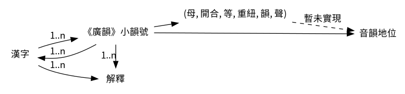

# qieyun-js [](https://www.jsdelivr.com/package/npm/qieyun)

《切韻》音系 JavaScript 函式庫

姊妹項目：《切韻》音系 SQLite 資料庫 \([sgalal/qieyun-sqlite](https://github.com/sgalal/qieyun-sqlite)\)。

## Usage

Browser:

```html
<script src="https://cdn.jsdelivr.net/npm/qieyun@0.6.0"></script>
```

Node.js:

```sh
$ npm install qieyun
```

```javascript
> const Qieyun = require('qieyun');
```

## API



**一、由漢字查出對應的《廣韻》小韻號和解釋**

```javascript
> Qieyun.query漢字('過');
[ { "小韻號": 739, "解釋": "經也又過所也釋名曰過所至關津以示之也或曰傳過也移所在識以爲信也亦姓風俗通云過國夏諸侯後因爲氏漢有兖州刺史過栩" }
, { "小韻號": 2837, "解釋": "誤也越也責也度也古臥切七" }
]
```

`query漢字` 函數的參數為單個漢字，返回值為一個數組。數組的每一項包括 `小韻號` 與 `解釋` 兩個字段。小韻號表示該字在《廣韻》中的小韻號，取值 (1 ≤ _i_ ≤ 3874)。

若找不到結果，則返回空數組。

**注意！**此函數不具備異體字轉換功能，如：

```javascript
> Qieyun.query漢字('笑');
[]
> Qieyun.query漢字('𥬇');
[{ "小韻號": 2768, "解釋": "欣也喜也亦作笑私妙切五" }]
```

**二、由《廣韻》小韻號查出對應的漢字和解釋**

```javascript
> Qieyun.query小韻號(1919);
[
  [ '拯', '救也助也無韻切音蒸上聲五' ],
  [ '抍', '[同上]' ],
  [ '撜', '並上同見說文' ],
  [ '𨋬', '[⿱氶車/𨋬]' ],
  [ '氶', '晉譙王名' ]
]
```

`query小韻號` 函數的參數為《廣韻》中的小韻號，返回值為二維數組，表示該小韻中的所有漢字及其解釋。

**三、查詢《廣韻》某個小韻的反切**

```javascript
> Qieyun.get上字(1);
"德"
> Qieyun.get下字(1919);  // 拯小韻無反切
null
> Qieyun.get反切(1644);  // 轉小韻
"陟兖切"
```

**四、查詢《廣韻》小韻號對應的《切韻》音系音韻地位**

```javascript
> let 音韻地位 = Qieyun.get音韻地位(739);
```

亦可使用字符串 \(母, 開合, 等, 重紐, 韻賅上去入, 聲\) 初始化：

```javascript
> let 音韻地位 = new Qieyun.音韻地位("見", "合", "一", null, "戈", "平");
```

注意：目前暫未實現錯誤處理。

**五、由《切韻》音系音韻地位得出各項音韻屬性**

```javascript
> let 音韻地位 = Qieyun.get音韻地位(739);
> 音韻地位.get音韻描述();
"見合一戈平"
> 音韻地位.get母();
"見"
> 音韻地位.get韻賅上去入();
"戈"
> 音韻地位.get攝();
"果"
```

此類函數包括：

* 母類：`get母`
* 開合類：`get開合`
* 等類：`get等`
* 重紐類：`get重紐`
* 韻類：`get韻`, `get韻賅上去入`, `get攝`, `get聲`
* 綜合類：`get音韻描述`

**六、判斷某個小韻是否屬於給定的音韻地位**

```javascript
> let 音韻地位 = Qieyun.get音韻地位(1919);  // 拯小韻
> 音韻地位.屬於('章母');
true
> 音韻地位.屬於('清韻');
false
> 音韻地位.屬於('重紐A類 或 以母 或 端精章組 或 日母');
true
```

`屬於` 函數：參數為表示音韻地位的字符串。

字符串中音韻地位的描述格式：`...母`, `...組`, `...等`, `...韻`, `...攝`, `...聲`, `開口`, `合口`, `重紐A類`, `重紐B類`。

字符串先以「或」字分隔，再以空格分隔。不支援括號。

如「(端精組 且 重紐A類) 或 (以母 且 四等 且 去聲)」可以表示為 `端精組 重紐A類 或 以母 四等 去聲`。

**注意！**`屬於` 函數中的「韻」指的是韻賅上去入

亦支援「開口」、「合口」、「重紐A類」、「重紐B類」四項。

## 説明

各參數的取值如下：

| 音韻屬性 | 中文名稱 | 英文名稱 | 可能取值 |
| :- | :- | :- | :- |
| 母<br/>組 | 聲母<br/>組 | initial<br/>group | **幫**滂並明<br/>**端**透定泥<br/>來<br/>**知**徹澄孃<br/>**精**清從心邪<br/>**莊**初崇生俟<br/>**章**昌常書船<br/>日<br/>**見**溪羣疑<br/>**影**曉匣云<br/>以<br/>（粗體字為組，未涵蓋「來日以」） |
| 等 | 等 | division | 一二三四 |
| 開合 | 開合 | rounding | 開口<br/>合口 |
| 重紐 | 重紐 | repeated initials | 重紐A類<br/>重紐B類 |
| 韻<br/>攝 | 韻母<br/>攝 | rhyme<br/>class | 通：東冬鍾<br/>江：江<br/>止：支脂之微<br/>遇：魚虞模<br/>蟹：齊祭泰佳皆夬灰咍廢<br/>臻：眞諄臻文欣元魂痕<br/>山：寒桓刪山先仙<br/>效：蕭宵肴豪<br/>果：歌戈<br/>假：麻<br/>宕：陽唐<br/>梗：庚耕清青<br/>曾：蒸登<br/>流：尤侯幽<br/>深：侵<br/>咸：覃談鹽添咸銜嚴凡<br/>（冒號前為攝，後為對應的韻） |
| 聲 | 聲調 | tone | 平上去入<br/>仄<br/>舒 |

**注意！**元韻置於臻攝而非山攝。

不支援異體字，請手動轉換：

* 母 娘 -> 孃
* 母 荘 -> 莊
* 母 谿 -> 溪
* 母 群 -> 羣
* 韻 餚 -> 肴
* 韻 眞 -> 真

## License

Dictionary data is in the public domain.

Source code is distributed under MIT license.
